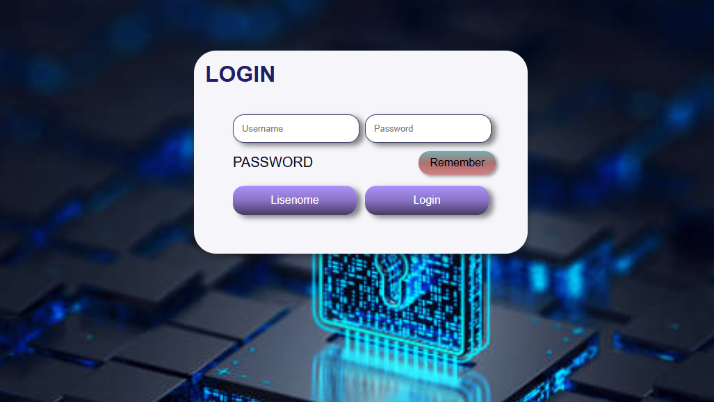

# Examen Medio Curso - Formulario de Inicio de Sesión

Este proyecto es una página de inicio de sesión estilizada para un examen de medio curso. Consiste en un formulario sencillo de ingreso con campos de usuario y contraseña, un botón para recordar la contraseña, y opciones de acción como "Listenme" y "Login".

## Estructura de Archivos

- `index.html`: Contiene el código HTML de la interfaz de inicio de sesión.
- `css/estilo.css`: Archivo de estilos que define el diseño y apariencia de la página de inicio de sesión.
- `img/istockphoto-1412282189-612x612.jpg`: Imagen de fondo usada en el formulario.

## Descripción de Componentes

### HTML (`index.html`)

El HTML contiene:
- Un `div` con clase `login-container` que envuelve todo el formulario.
- Campos de entrada para el nombre de usuario y la contraseña.
- Un botón para recordar la contraseña.
- Botones adicionales "Listenme" y "Login" en la parte inferior.

### CSS (`css/estilo.css`)

El archivo de estilos aplica los siguientes diseños:
- **Estilos generales**: Uso de la fuente `'Russo One'`, ajuste de `box-sizing` para mejorar la consistencia en el diseño.
- **Body**: Centrado del formulario en la pantalla, con una imagen de fondo que cubre el 100% del contenedor.
- **Contenedor de inicio de sesión (`.login-container`)**: Estilo de fondo, sombras y bordes redondeados para una apariencia moderna y llamativa.
- **Campos de entrada**: Personalización con bordes redondeados, sombras y diseño de flexibilidad para una disposición alineada y espaciosa.
- **Botones**: Diseño de gradiente de fondo y sombra en botones, además de un efecto `hover` para mejorar la interactividad.

## Cómo Ejecutar

1. Clona el repositorio.
2. Asegúrate de que la estructura de carpetas es la misma (principalmente el archivo de imagen en `img/` y los estilos en `css/`).
3. Abre el archivo `index.html` en tu navegador para ver el formulario de inicio de sesión.

### Captura de Pantalla (Opcional)
Para ver una captura del formulario, abre `index.html` en un navegador compatible y verifica el diseño final.

## Personalización

Puedes ajustar los siguientes aspectos en el archivo CSS:
- **Colores**: Modifica los gradientes y colores de fondo en `.button`, `.remember-button`, y `.login-container` según prefieras.
- **Fuente**: Cambia la fuente `'Russo One'` en la primera línea del CSS a cualquier otra que prefieras.
- **Imagen de Fondo**: Puedes cambiar la imagen de fondo en `body` actualizando la URL a otra imagen de tu elección.

## Requisitos Previos

Este proyecto solo requiere un navegador web para ejecutarse. Sin embargo, si necesitas ver los cambios en tiempo real, un editor de código con soporte de servidor en vivo (como Visual Studio Code con Live Server) es útil.

## Contribuciones

Para contribuir:
1. Haz un fork de este repositorio.
2. Crea tu propia rama (`git checkout -b feature/nueva-funcion`).
3. Haz commit a tus cambios (`git commit -m 'Agregar nueva funcionalidad'`).
4. Haz push a tu rama (`git push origin feature/nueva-funcion`).
5. Crea un Pull Request.

## Licencia

Este proyecto está disponible bajo la licencia MIT. Consulta el archivo `LICENSE` para más detalles.
